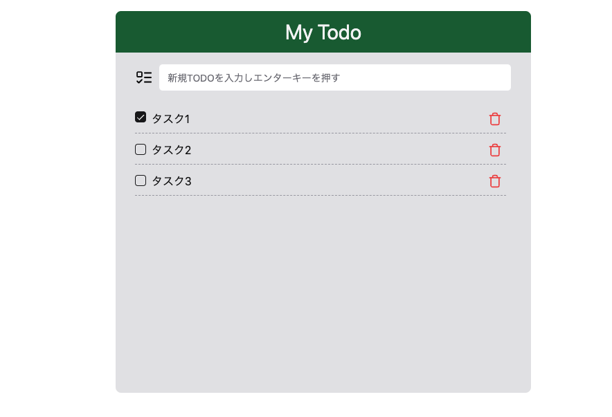

# Remix DB Hands-On

Remixで簡単なデータベースI/Oを体験するハンズ・オンです。

## 対象者

- Reactに関する知識・経験がある
- Remixに関して[tutorial](https://remix.run/docs/en/main/start/tutorial)をやったことがある
- リレーショナルデータベースでテーブル作成とデータの読み書きをやったことがある

## やること・やらないこと

### やること

- [drizzle-kit](https://orm.drizzle.team/kit-docs/overview)でsqliteのデータベースにテーブルを作成する
- [drizzle orm](https://orm.drizzle.team/docs/overview)を使いRemixアプリからデータを読み書きする

### やらないこと

- 今回の題材であるToDoアプリの解説
- Remixにおけるloader, action, コンポーネントの詳細な解説
- [tailwndcss](https://tailwindcss.com/docs/installation)のインストール方法や使い方
- [better-sqlite3](https://github.com/WiseLibs/better-sqlite3)のインストールや環境設定方法
- drizzle, drizzle-kitのインストールや環境設定方法

## 事前準備

ハンズオンに参加する方は、以下の事前準備を済ませておいて下さい。

1. [ハンズオン用ソースコード](https://github.com/hiszuk/remix-db-handson/archive/refs/tags/hands-on-init.zip)をダウンロード
2. 適当なフォルダに展開し、`npm install`する
3. `npm run dev`し、http://localhost:5173 にアクセスすると下図のような画面が表示されたらOKです

